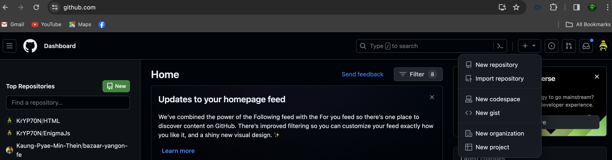
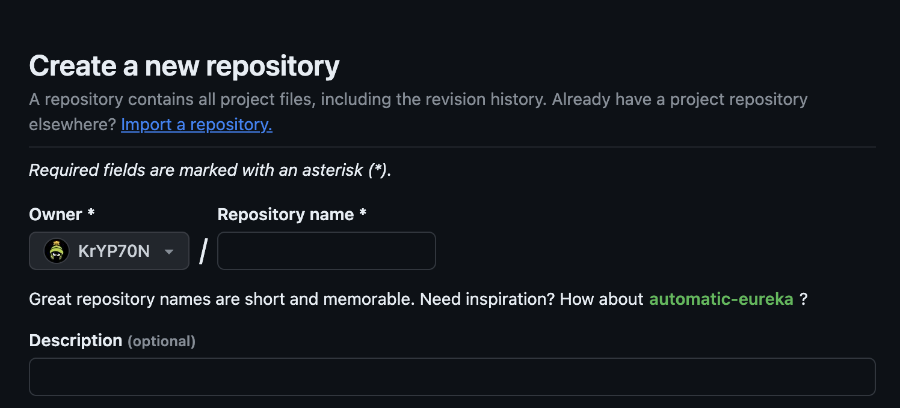
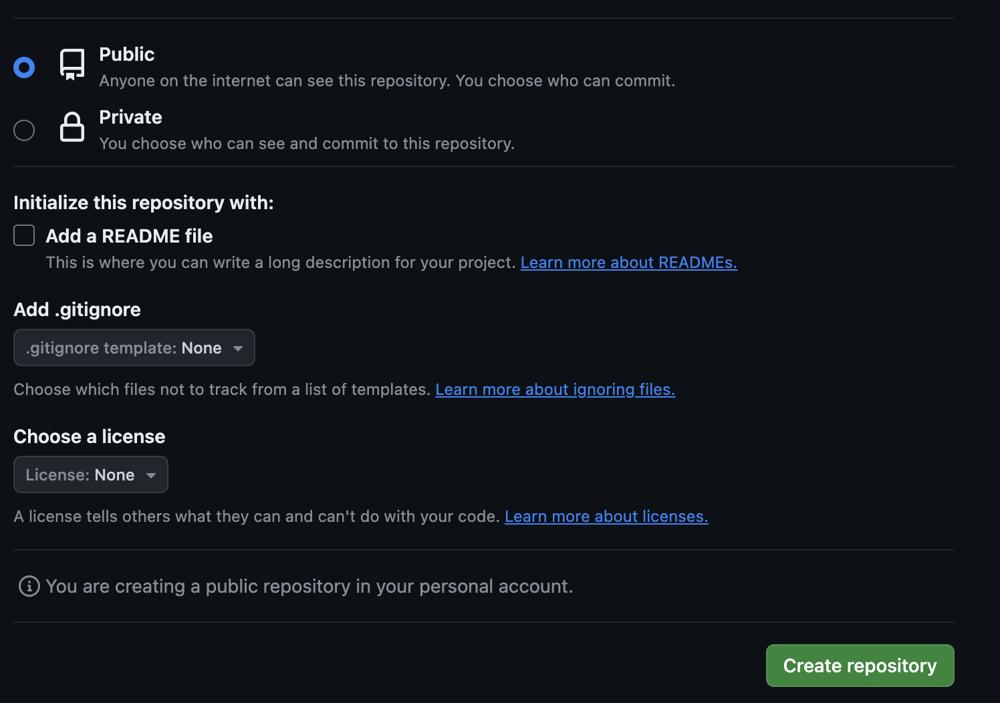
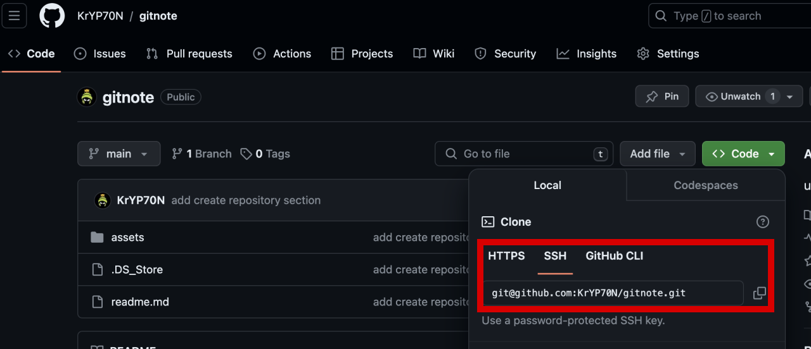

### What is GIT
Free open source version control system.


### What is version control
Version control can manage to changes to doc, program and other collections of information.


### Terms

1. **VSC** : Version control system
2. **clone** : bring a repository that's hosted in vcs provider to your local machine
3. **add** : Add changes to your next commit.
4. **commit** : Add change note to your repository.
5. **push** : Upload commit to your remote repo.
6. **pull** : Download changes. 


## Setup Guide

### Install GIT Client in local machine

1. download [git SCM](https://git-scm.com/downloads).
2. Open your terminal and run `git --verison`. If your installation succeed, you will see git version in termial output.


### Setup your git account in local machine

Tailor your Git configuration to your needs by choosing either **global** or **project** scope.

#### Setup globally

1. Open your terminal.
2. To setup user name, enter following command 
```git config --global user.name "your name"```
3. To setup user email, enter following command
```git config --global user.email "your email"```
4. Check your user name and email back with 
``` git config user.email```
``` git config user.name```

> For the **project** scope setup you can run back step 1->4 without **--global** flag.


### Generate SSH keys

Using SSH with git provides more secure communication. We can set up easily with following steps : 

1. Open `git bash`
2. check your existing SSH key using. 
```ls -al ~/.ssh ```
3. If you didn't found related SSH key file, you can generate new one by running:
```ssh-keygen -t rsa -b 4096 -C "your.email@example.com"```
4. Start the SSH agent to manage your SSH key.
```eval "$(ssh-agent -s)"```
5. Add SSH key to your agent
```ssh-add ~/.ssh/id_rsa```
6. View your SSH key with
```cat ~/.ssh/id_rsa.pub```
7. Add SSH key to your Github account under Github account setting.
8. You can test SSH connection between your local machine and github with 
```ssh -T git@github.com```

**command comprehensive**

| command name     | description       |
| ---------------- | ----------------- |
| ls               | list everything under current directory    |
| -a               | stand for `All`                            |
| -l               | stand for `long format`                    |
| ssh-keygen       | commandline utility for generating SSH key |
| -t rsa           | type of key to create (in this case, we created `RSA` type) |
| eval             | evaluate      |
| -s               | ssh-agent to make it print commands to set environment variables. |
| ssh-add [path]   | adding SSH key from the path to your `ssh agent` |
| cat              | concatenate and display the contents of files |


### Creating repository

1. Open `[github](https://github.com/)` from your browser.
2. Click `+` sign from the right side menu. 
3. Click `New repository`.



4. Enter `repository name` and `repository description(Optional)`.



5. Base on your situration fill up additional information such as `public or private` repo, `add readme file` and `license`.



6. Click `Create repository` to create your new repository.


### Connect your project with git repository

To perform various tasks related to version control, you'll need to connect your project to a Git repository.
You can easily connect by following steps.

1. Initialize git project using
```
git init
```

2. Add remote link with follwing command. You can check remote url in `code` dropdown under your repository section. Check detail at figure.
```
remote add origin [your origin]
```



3. Once you've completed the setup process, you can verify the status of your repository by using the git status command. This command allows you to see the current Git status of your project. If the connection was successful, you'll receive information about any changes made to your files and their staging status. Conversely, if your project wasn't successfully connected to a Git repository, you'll receive a message indicating that it's not recognized as a Git repository.


## Tracking Changes

The main purpose to using **VCS** is to track changes file in your projects and collaborate on projects with ease.
Let's find out how to track your changes.


#### Uploading your new changes

In this section, We will explore how to upload changes files and content to your git repository.

1. Check the status of your repository to see which files have been modified or are ready to be committed.
2. Use `git add` command to stage the changes you want to include in the commit. You can stage specific files or all changes in the working directory.
```
# Stage specific file
git add filename
```
```
# Stage all changes
git add .
```
3. Commit the staged changes with a descriptive commit message.
```
git commit -m "Your meaningful commit message here"
```
4. Push to remote repository.
```
git push
```


#### Updating changes to your local

One of the most important part of the VCS is sync data with local and cloud (hosted repository).
You can sync by following steps.

1. Check update local repository with hosted repository.
```
git fetch
```

2. If you found any changes, you just need to sync with these command.
```
git merge origin/main
```

